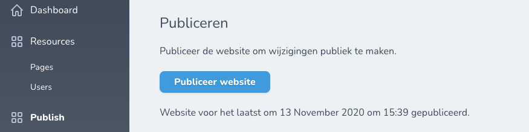

# Nova publish

<!-- Header & Preview Image -->
<h1 align="center">
  
</h1>

<!-- Shields -->

[](https://github.com/grrr-amsterdam/nova-publish/actions/workflows/run-tests.yaml) [](https://github.com/grrr-amsterdam/nova-publish/actions/workflows/code-style.yaml)

<!-- Description -->

> Adds a publish button to Nova to trigger a GitHub workflow which runs you static site generator

### Developed with ❤️ by [GRRR](https://grrr.nl)

- GRRR is a [B Corp](https://grrr.nl/en/b-corp/)
- GRRR has a [tech blog](https://grrr.tech/)
- GRRR is [hiring](https://grrr.nl/en/jobs/)
- [@GRRRTech](https://twitter.com/grrrtech) tweets

## Requirements

[Return To Top](#nova-publish)

- PHP 8.0, 8.1, 8.2
- Laravel 8, 9, 10
- Nova 4

## Installation

[Return To Top](#nova-publish)

Add the repository to `composer.json`

```JSON
"repositories": [
    {
        "type": "vcs",
        "url": "https://github.com/grrr-amsterdam/nova-publish"
    }
]
```

Add install the package

```shell script
composer require grrr-amsterdam/nova-publish
```

Load the tool by adding it to `NovaServiceProvider.php`

```php
use Publish\Publish;

public function tools()
{
    return [new Publish()];
}
```

Publish configuration

```shell
php artisan vendor:publish --provider="Publish\ToolServiceProvider"
```

Configure GitHub credentials, set the path to the workflow file and configure an application version.

=======

## Local development

Run `npm run dev` to watch for changes in the `resources/js` directory.

Use the local checkout in a project that uses this plugin. [The Composer documentation explains how to do this.](https://getcomposer.org/doc/05-repositories.md#path)

## i18n

To add a language or change an existing translation, please read the [Laravel documentation about overriding package language files](https://laravel.com/docs/10.x/localization#overriding-package-language-files).

## GitHub API credentials

Personal Access Tokens (PATs) are currently the only way to access the GitHub API. The token is created by a GitHub user. So when this user is removed from the GitHub organization the token must be recreated by another user. Not ideal, so there is room for improvement.

Create a Personal Access Token: https://github.com/settings/tokens

- Note: the name of the project
- Expiration: No expiration (or you have to replace the token every time it expires)
- Scopes: "repo" and "workflow"

Add the created token as environment variable `PUBLISH_GITHUB_PERSONAL_ACCESS_TOKEN`.

You GitHub username must be stored in `PUBLISH_GITHUB_USERNAME`.

## Contribute

You need a Nova license to run the tests.
